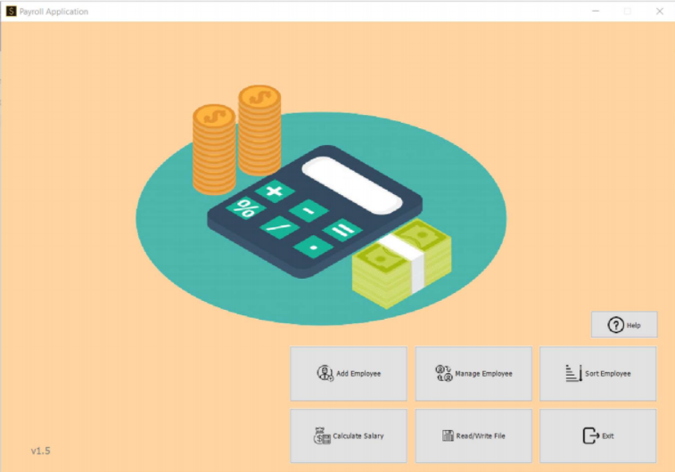
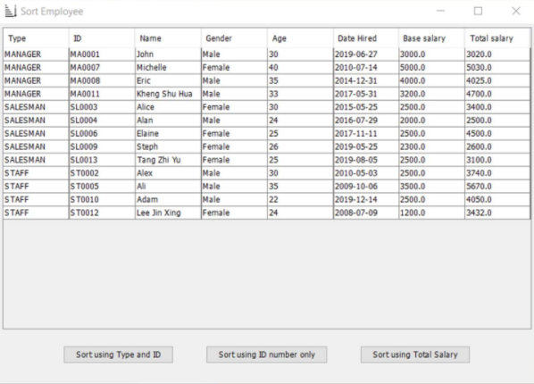
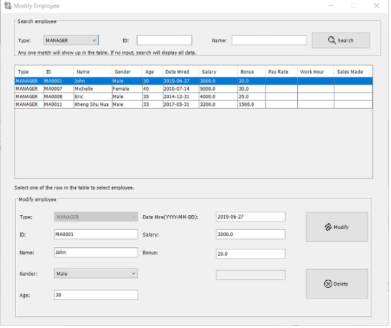

<u>Table of Contents</u>

[toc]

# Object Oriented Programming Approach Assignment

This is a school group assignment aim to learn:

- introduction java 
- object oriented programming 
- GUI 

A simple employee management system that reads data from txt files with GUI interface. Functions includes add new employee, calculate salary, modify and delete employee data, sort employee.

## Built with

- Java
- Swing

## Screenshot

Menu Page

Add employee

Sort Employee

Calculate Salary

Modify Employee Details

